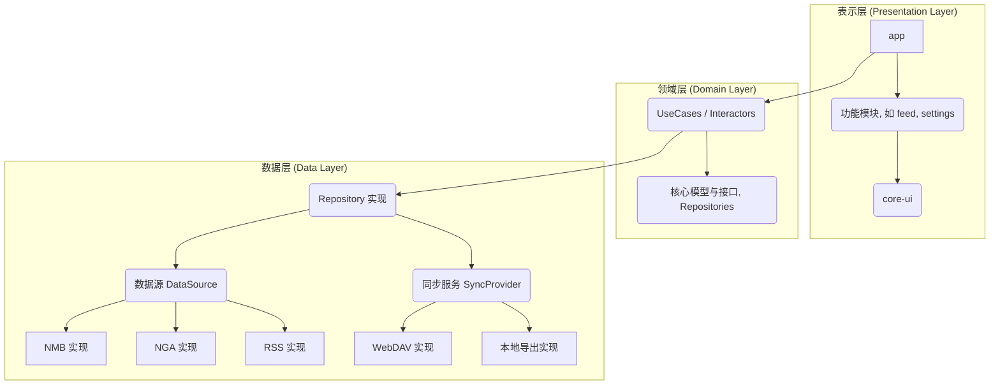

# Thread - 一个多平台信息流聚合器

`Thread` 是一个使用 Kotlin Multiplatform 技术构建的信息流聚合平台，旨在将来自不同来源（如论坛、RSS）的信息整合到一个统一、现代且高性能的跨平台应用中。

## ✨ 核心功能 (Core Features)

-   **多源聚合**: 支持从多个信息源（当前已接入 NMB，规划中：NGA, Tieba, RSS, Mastodon）获取内容，并以统一的时间线呈现。
-   **可扩展架构**: 基于整洁架构（Clean Architecture），添加新的信息源或同步方式变得简单高效。
-   **数据同步**: （规划中）支持通过 WebDAV 或本地文件导入/导出用户数据。
-   **跨平台**: 一套代码库，可编译运行于 Android, iOS, Desktop (JVM) 等多个平台。

## 🏛️ 架构 (Architecture)

项目采用标准的整洁架构（Clean Architecture），以确保代码的可维护性、可测试性和可扩展性。

-   **依赖倒置原则**: 上层模块不依赖于下层模块的具体实现，而是依赖于抽象。`Presentation` -> `Domain` <- `Data`。
-   **分层设计**:
    -   **`Presentation` (表示层)**: 由 `composeApp` 和 `feature-*` 模块组成，负责 UI 展示和用户交互。
    -   **`Domain` (领域层)**: 由 `core-domain` 模块实现。定义了应用的核心业务逻辑 (`UseCase`) 和数据抽象 (`Repository` 接口)，不依赖任何具体框架。
    -   **`Data` (数据层)**: 由 `core-data` 模块实现。负责实现 `Domain` 层的接口，处理所有数据的获取、存储和同步。
-   **依赖注入**: 使用 Kodein (DI) 实现各层之间的解耦。

### 数据库的角色：缓存与离线支持

在当前架构中，数据库（如 SQLDelight）并非一个独立的层，而是 **`Data` 层的一个实现细节**。其核心职责是作为远程数据的 **本地缓存**，以提供离线能力和提升性能。

-   **`Repository` 模式**: `FeedRepositoryImpl` 作为数据流的“总指挥官”，当被请求数据时，它会优先查询本地数据库。
-   **缓存策略**: 只有当本地数据不存在或过期时，`Repository` 才会向远程 `Source` (如 `NmbSource`) 发起网络请求。获取到新数据后，会先更新本地数据库，再返回给上层。
-   **对上层透明**: `Domain` 层和 `Presentation` 层完全不知道数据库的存在。它们只与 `Repository` 接口交互，从而实现了对数据持久化逻辑的完全解耦。

### 数据流向与 Domain 层的核心价值

本架构严格遵循单向数据流和依赖倒置原则，确保各层职责单一且高度解耦。

1.  **UI 层不直接与数据层通信**: `feature-*` 模块（UI层）**绝不会**直接调用 `Data` 层的任何实现（如 `NmbSource`）。
2.  **Domain 层是唯一桥梁**: UI 层的所有数据请求都必须通过 `Domain` 层的 `UseCase` 发起。`UseCase` 封装了业务逻辑，并调用 `Repository` 接口来获取数据。
3.  **契约式编程**: `Domain` 层定义了稳定的数据模型和接口（契约），UI 层和数据层都面向这个契约编程。这使得数据层的具体实现（API、数据库）可以被随意替换，而无需修改任何 UI 层代码，保证了架构的灵活性和韧性。

### UI 架构分层

表示层（UI）内部也进行了精细的分层，以保证职责清晰：

-   **`composeApp` (应用壳/导航层):** 作为应用的“壳”，负责组装所有功能。它定义了主导航框架（如底部导航栏），并管理各个 `feature-*` 模块的入口。
-   **`feature-feed` (聚合信息流模块):** 提供统一的、跨所有来源的信息流主页。当用户点击帖子时，它会根据来源导航到相应的 `feature-xxx` 模块进行展示。
-   **`feature-*` (源特定功能模块):** 提供与特定信息源（如 NMB, NGA）相关的完整功能闭环，包括帖子详情、回复、发帖等具有该源特色的 UI 和交互。虽然功能上与特定源绑定，但其数据交互严格遵守上述数据流向规则，通过 `Domain` 层进行。
-   **`core-ui` (通用组件库):** 提供在所有模块间共享的、无状态的 UI 组件，确保应用视觉风格统一。



## 🛠️ 技术栈 (Tech Stack)

-   **[Kotlin Multiplatform](https://kotlinlang.org/docs/multiplatform-mobile-getting-started.html)**: 跨平台开发框架。
-   **[Compose Multiplatform](https://www.jetbrains.com/lp/compose-multiplatform/)**: 用于构建声明式的、现代化的 UI。
-   **[Voyager](https://voyager.adriel.cafe/)**: 用于 Compose Multiplatform 的导航库。
-   **[Kodein](https://kodein.org/di/)**: 轻量级的依赖注入框架。
-   **[Ktorfit](https://foso.github.io/Ktorfit/)**: 基于 Ktor 的类型安全 HTTP 客户端。
-   **[SQLDelight](https://cashapp.github.io/sqldelight/)**: 生成类型安全的 Kotlin API 来操作 SQL 数据库。

## 📦 模块划分 (Module Structure)

-   **`composeApp`**: 主应用模块，包含各平台入口和共享 UI。
-   **`feature-*`**: 各个独立的功能模块（如 `feature-nmb`）。
-   **`core-domain`**: **领域层**。包含核心业务逻辑和接口。
-   **`core-data`**: **数据层**。负责所有数据的获取与实现。
-   **`core-common`**: 平台无关的通用工具。
-   **`core-ui`**: 跨功能模块共享的通用 UI 组件。

## 🧩 如何添加新源 (以 `Tieba` 为例)

本架构使得添加新的信息源变得高度模式化。以下是添加“贴吧”源的完整步骤：

1.  **`core-data` 模块 (实现数据获取)**
    -   在 `source` 包下创建 `tieba` 目录。
    -   **API**: 创建 `TiebaApi.kt` 接口，定义 Ktorfit 网络请求。
    -   **DTO**: 在 `remote/dto` 中创建 `TiebaDto.kt`，定义匹配 API 响应的数据类。
    -   **Mapper**: 创建 `TiebaMapper.kt`，编写扩展函数将 `TiebaDto` 转换为 `Domain` 层的 `Post` 模型。
    -   **Source**: 创建 `TiebaSource.kt`，实现 `domain` 层的 `Source` 接口，调用 `TiebaApi` 并使用 `Mapper` 转换数据。
    -   **DI**: 在 `di/Di.kt` 中，将 `TiebaApi` 和 `TiebaSource` 注入到 Kodein 容器中。

2.  **`core-domain` 模块 (定义业务)**
    -   **通常无需修改**。只有当贴吧详情页需要展示“楼中楼”等特殊信息时，才 **新增** 一个 `TiebaThreadDetails.kt` 模型和 `GetTiebaThreadDetailsUseCase.kt`。

3.  **`feature-tieba` 模块 (实现特定UI)**
    -   **新建模块**: 创建一个名为 `feature-tieba` 的新模块。
    -   **Screen**: 创建 `TiebaThreadScreen.kt`，用于展示贴吧帖子的详情页，包括其特有的“楼中楼”UI。
    -   **ViewModel**: 创建对应的 `TiebaThreadViewModel.kt`，它会通过 `Domain` 层的 `UseCase` 获取数据。

4.  **`composeApp` 模块 (集成功能)**
    -   在 `settings.gradle.kts` 中 `include(":feature-tieba")`。
    -   在主导航逻辑中，当检测到用户点击的 `Post` 其 `sourceName` 为 "Tieba" 时，导航到 `TiebaThreadScreen`。

通过以上步骤，一个功能完备、UI 独特且与主应用解耦的新信息源就被完整地添加进来了。

## 📈 项目状态与未来规划 (TODO)

当前项目已完成核心的架构重构，为后续功能开发奠定了坚实基础。

-   [x] **1. 架构重构**: 创建 `domain` 和 `data` 核心模块，明确各层职责。
-   [x] **2. 定义核心抽象**: 在 `domain` 模块中定义 `Source`、`Repository` 等核心接口。
-   [x] **3. 迁移现有实现**: 将 `nmb` 的数据获取逻辑迁移到 `data` 模块。
-   [x] **4. 实现聚合信息流**: 创建 `AggregatedFeedUseCase` 和 `FeedRepository` 实现。
-   [x] **5. 验证架构扩展性**: 以 `NgaSource` 为例，证明添加新源的可行性。
-   [ ] **6. 修复编译错误**: 修复因重构导致的 `composeApp` 和 `feature-nmb` 中的编译问题。
-   [ ] **7. 实现缓存逻辑**: 在 `FeedRepositoryImpl` 中集成 SQLDelight，实现完整的缓存策略。
-   [ ] **8. 实现 `feature-feed`**: 创建聚合信息流的 UI 页面，调用 `GetAggregatedFeedUseCase` 展示数据。
-   [ ] **9. 完善源特定功能**: 完整实现 `feature-nmb` 的详情页和交互逻辑。
-   [ ] **10. 完善同步功能**: 对接真实的 WebDAV 服务和本地文件读写逻辑。

## 🚀 如何构建与运行 (Build & Run)

1.  **环境要求**:
    -   Android Studio (最新版本)
    -   JDK 17 或更高版本
    -   (macOS) Xcode 用于运行 iOS 应用

2.  **构建**:
    在项目根目录下执行以下命令：
    ```bash
    ./gradlew build
    ```

3.  **运行**:
    -   **Android**: 在 Android Studio 中选择 `composeApp` 作为运行配置，然后选择一个模拟器或连接的设备来运行。
    -   **Desktop**: 执行 Gradle 任务 `:composeApp:run`。
    -   **iOS**: 在 Android Studio 中选择 `iosApp` 运行配置，或直接在 Xcode 中打开 `iosApp` 项目来运行。


#  reference
https://github.com/TransparentLC/xdcmd/wiki/%E8%87%AA%E5%B7%B1%E6%95%B4%E7%90%86%E7%9A%84-X-%E5%B2%9B%E5%8C%BF%E5%90%8D%E7%89%88-API-%E6%96%87%E6%A1%A3

https://github.com/lumina37/aiotieba

https://github.com/HuanCheng65/TiebaLite

// nga api
// rss feed

https://m3.material.io/foundations/adaptive-design

https://developer.android.com/develop/ui/compose/layouts/adaptive/build-adaptive-navigation

// sample
https://github.com/kagg886/Pixiv-MultiPlatform
https://github.com/0xZhangKe/Fread
https://github.com/panpf/zoomimage/tree/main/sample/src/commonMain/kotlin/com/github/panpf/zoomimage/sample/ui/examples
https://github.com/TheChance101/beep-beep
