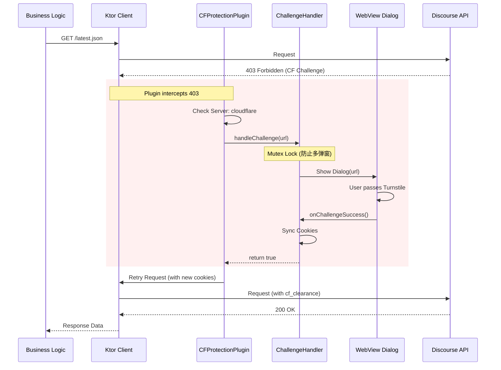

# Cloudflare 403 拦截与验证重试机制设计

## 1. 问题背景
Discourse API (如 `linux.do`) 启用了 Cloudflare 保护。当 API 请求触发风控时，会返回 `403 Forbidden`，响应头包含 `Server: cloudflare`，响应体为 HTML 格式的 Challenge 页面。此时需要用户在浏览器环境中完成人机验证（Turnstile），获取 `cf_clearance` Cookie 后才能继续访问。

## 2. 核心目标
1.  **自动拦截**: 在网络层自动识别 Cloudflare 403 响应。
2.  **用户介入**: 挂起请求，唤起 App 内置 WebView 展示验证页面。
3.  **无感重试**: 验证通过后，自动同步 Cookie 并重试原请求，对上层业务逻辑透明。
4.  **并发处理**: 多个并发请求触发风控时，只弹出一个验证窗口。

## 3. 架构设计

### 3.1 模块职责

*   **`core-network`**:
    *   `ChallengeHandler`: 接口，定义处理 Challenge 的契约。
    *   `CloudflareProtectionPlugin`: Ktor 插件，负责拦截、挂起、重试。
    *   `CookieProvider`: 增强为支持读写的 Cookie 管理接口。

*   **`composeApp`**:
    *   `UiChallengeHandler`: `ChallengeHandler` 的实现，负责控制 UI 显示。
    *   `CloudflareVerificationDialog`: Compose 组件，包含 WebView。
    *   `WebView`: 负责加载 URL，执行 JS，并同步 Cookie 到 `CookieManager`。

### 3.2 交互时序图



## 4. 详细实现方案

### 4.1 `ChallengeHandler` 接口 (core-network)

```kotlin
interface ChallengeHandler {
    /**
     * 处理 Cloudflare 挑战
     * @param url 触发挑战的 URL
     * @return Boolean 验证是否成功
     */
    suspend fun handleChallenge(url: String): Boolean
}
```

### 4.2 `CloudflareProtectionPlugin` (core-network)

这是一个 Ktor Client 插件。

```kotlin
class CloudflareProtectionPlugin(
    private val challengeHandler: ChallengeHandler
) {
    companion object : HttpClientPlugin<Config, CloudflareProtectionPlugin> {
        // ... standard plugin setup ...
    }

    fun install(scope: HttpClient) {
        scope.plugin(HttpSend).intercept { request ->
            val originalCall = execute(request)
            
            if (originalCall.response.status == HttpStatusCode.Forbidden &&
                originalCall.response.headers["Server"] == "cloudflare"
            ) {
                // 触发验证流程
                val success = challengeHandler.handleChallenge(request.url.toString())
                
                if (success) {
                    // 验证成功，重试请求
                    // 注意：Cookie 应该已经由 Handler 同步到了 CookieStorage
                    return@intercept execute(request)
                }
            }
            
            return@intercept originalCall
        }
    }
}
```

### 4.3 `UiChallengeHandler` (composeApp)

使用 `Mutex` 确保同一时间只有一个验证流程。

```kotlin
class UiChallengeHandler(
    private val eventBus: SharedFlow<ChallengeEvent> // 或者其他通知 UI 的机制
) : ChallengeHandler {
    
    private val mutex = Mutex()

    override suspend fun handleChallenge(url: String): Boolean = mutex.withLock {
        // 1. 发送事件通知 UI 显示弹窗
        // 2. 挂起等待 UI 结果 (使用 CompletableDeferred)
        // 3. 返回结果
    }
}
```

### 4.4 WebView Cookie 同步

在 Android/iOS 端，WebView 的 Cookie 存储与 Ktor 的 `HttpCookies` 插件默认是不互通的。
我们需要实现一个机制：
1.  WebView 验证成功后，读取 `cf_clearance` 等关键 Cookie。
2.  将这些 Cookie 写入到 Ktor 使用的 `CookieStorage` 或 `CookieProvider` 中。

## 5. 下一步行动
1.  在 `core-network` 中定义 `ChallengeHandler`。
2.  实现 `CloudflareProtectionPlugin`。
3.  在 `composeApp` 中实现 UI 逻辑。